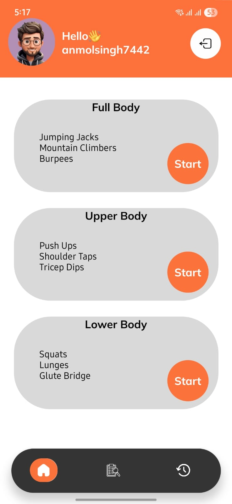
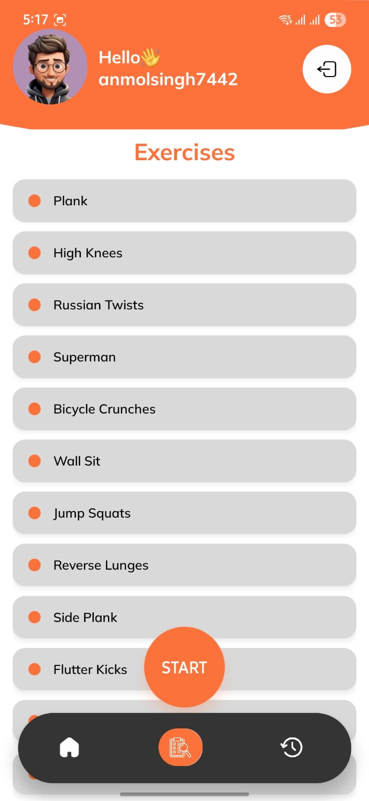
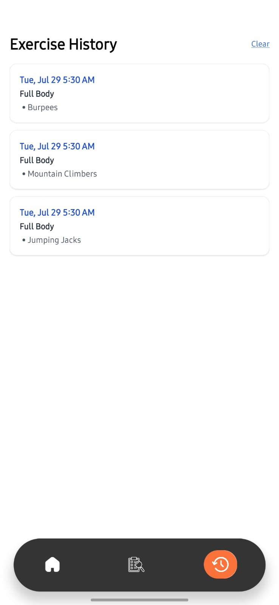

# Workout App 🏋️‍♂️

A simple fitness app built with **React Native (Expo)** and **Firebase Authentication**, designed to guide users through predefined workouts with a built-in timer and save workout history.

---

## 🔥 Features

- Firebase Email/Password Authentication
- 3 Hard-coded Workout Types:
  - Full Body
  - Upper Body
  - Lower Body
- Workout Detail Screen
- Timer with Auto-Advance
- Workout History Tracking
- Tailwind-like styling via `nativewind`

---

## 📱 Screens

### 1. Welcome Screen
- Simple intro with a "Get Started" button

### 2. Auth Flow
- Sign In and Sign Up using Email & Password
- Firebase Authentication

### 3. Home Screen
- List of 3 workout types (hardcoded)

### 4. Detail Screen
- Shows list of exercises
- Start button launches timer per exercise
- Automatically moves to next exercise

### 5. History Tab
- Logs completed workouts with date & type
- Stored locally using AsyncStorage
- Shown as:
  - List of workouts

---

## 🛠️ Tech Stack

- **React Native (Expo)**
- **Firebase Auth**
- **AsyncStorage** (Workout history)
- **React Navigation (Tabs & Stack)**
- **NativeWind (Tailwind CSS for RN)**
- **Countdown Timer (Auto-play)**
- **TypeScript**

---


## 🧹 Code Quality

This project uses:

- **ESLint** – for static code analysis and catching issues
- **Prettier** – for consistent code formatting

<h2>📸 Screenshots</h2>

<p align="center">
  
  
  
</p>

<p align="center">
  
  
  
</p>


## 📹 Screencast

[Click to view the screencast](demo/demo.mp4)


## 🚀 Getting Started

```bash
git clone https://github.com/your-username/workout-app.git
cd workout-app
npm install
npx expo start


